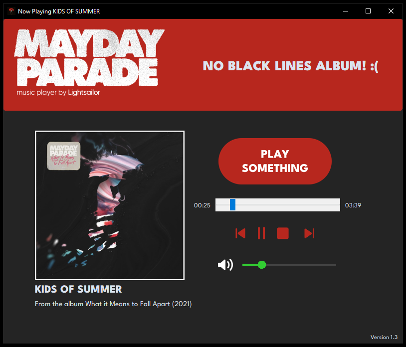

# 🎼 Mayday Parade Music Player (Python) 🐍

## ✨ Features
- Play/pause audio playback
- .flac files supported
- UI constructed using `customtkinter`
- Real-time elapsed time and duration display
- Responsive and beginner-friendly interface
- Black Lines (2015) Album can be excluded/included

## 🛠️ Built With
- **Python** — Core programming language
- **tkinter** — Standard GUI library
- **customtkinter** — For a modern UI look
- **pygame** — For audio playback

## 📝 Notes
- Only **7 Albums** (ALIR to WIMTFA) and **3 EPs** (Tales, Valdosta, and Out of Here) are included
- Black Lines can be excluded or included from the song list by clicking the `"No Black Lines Album"` text
- Once a song finishes playing, the system automatically selects and plays another track at random, effectively operating in a default shuffle mode.

## 📂 Why I Built This
This project started as a personal exploration of Python's GUI and multimedia capabilities.
I wanted a simple and functional app to play Mayday Parade songs (since I'm a huge fan of the band) while practicing Python in a creative way.
It's also part of a broader goal to explore more projects outside my main academic and professional focus.

## ⚠️ Disclaimer
This project is intended **for personal use and educational purposes only.**
It is **not meant to be deployed, redistributed, or shared publicly** in any form that includes copyrighted media files (such as songs).

The audio files used during development and testing are assumed to be locally owned or licensed for personal use.
Please ensure you do not include or distribute any copyrighted material when sharing or forking this repository.
